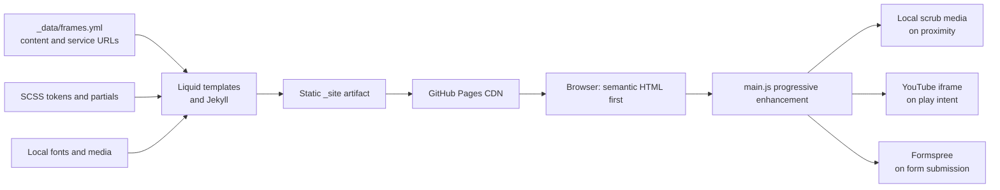
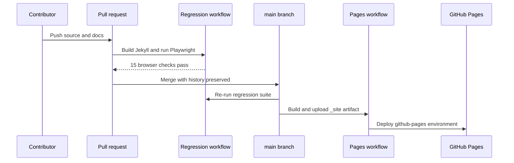

# Technical architecture

**Audience:** developers, technical owners, reviewers, and software agents

**Purpose:** describe the production system, its boundaries, and the runtime data flow

**Last verified:** August 2, 2026

## Architecture summary

ZEMA is a statically generated, single-page Jekyll site. Liquid templates render structured YAML content into semantic HTML; Jekyll compiles SCSS; one framework-free JavaScript file progressively enhances scroll media, audio, the YouTube facade, the custom pointer, header contrast, and form feedback. GitHub Actions builds the site and GitHub Pages serves the output over HTTPS.

There is no application server, database, client-side router, package runtime, analytics SDK, or repository secret.

## Technology boundary

| Layer | Choice | Reason |
| --- | --- | --- |
| Source and templates | Jekyll, Liquid, YAML | Supported by GitHub Pages; readable by non-framework specialists |
| Markup | Static semantic HTML | Fast first render, robust fallback, accessible browser behavior |
| Styling | SCSS compiled and compressed by Jekyll | Shared tokens and primitives without a client runtime |
| Interaction | Framework-free JavaScript | The behavior is small, page-specific, and based on native browser APIs |
| Media | Local optimized derivatives plus local posters | Reliable scroll seeking and controlled LCP |
| Complete film | `youtube-nocookie.com` facade | Native video controls and captions without a second large local master |
| Inquiry delivery | Formspree | Static-site-compatible delivery with native POST fallback |
| Hosting | GitHub Pages | No server maintenance, low cost, HTTPS, and history-backed deployment |
| Testing | Playwright and axe-core | Browser-level contracts for interaction, accessibility, responsive layout, and network behavior |

See [the decision record](DECISIONS.md) for alternatives and tradeoffs.

## Repository map

| Path | Responsibility |
| --- | --- |
| `_config.yml` | Host/base path, SEO defaults, cache version, Sass and build exclusions |
| `_data/frames.yml` | Public content model, venue facts, form endpoint, external links, film credits, and media paths |
| `index.html` | Ordered page composition and the inline intro/gallery sections |
| `_layouts/default.html` | Document shell, skip link, global header/footer, soundtrack, pointer, and script loading |
| `_includes/head.html` | Metadata, social cards, canonical URL, preload, and JSON-LD |
| `_includes/frame-*.html` | Hero, dossier, inquiry, and complete-film section templates |
| `_includes/site-audio.html` | Single soundtrack element and control |
| `assets/css/_theme70s.scss` | Design tokens and shared SCSS placeholders |
| `assets/css/_reset.scss` | Global inheritance, focus, selection, and reduced-motion reset |
| `assets/css/_layout.scss` | Header, footer, soundtrack, pointer, and global layout |
| `assets/css/_frame.scss` | Page-section layout and responsive behavior |
| `assets/js/main.js` | All progressive enhancement behavior |
| `assets/media/` and `assets/fonts/` | Production media, marks, posters, pointer, and the licensed title font |
| `tests/e2e/` | Browser contracts and accessibility/SEO checks |
| `scripts/serve-test-site.sh` | Deterministic production-mode Jekyll build and byte-range-capable local server |
| `scripts/check-docs.js` | Dependency-free handbook presence, heading, whitespace, and relative-link validation |
| `.github/workflows/` | Pull-request regression and GitHub Pages deployment pipelines |

## Content and rendering model

`_data/frames.yml` is the only content model. Templates access it as `site.data.frames`; the same fields feed visible text, links, the form, audio sources, film metadata, and LocalBusiness structured data.

This avoids a common static-site failure mode: duplicating venue facts in visible HTML, metadata, and schema. Opening hours, address, phone, and Instagram should be changed in YAML and then verified in both rendered content and JSON-LD.

The page has no client-side route. Jekyll's `baseurl` support and Liquid's `relative_url`/`absolute_url` filters keep project-page paths correct under `/zema-landing/`.

## JavaScript subsystem boundaries

`assets/js/main.js` is a single private IIFE. It does not expose globals. The major responsibilities are deliberately separated by functions and `data-*` hooks:

| Subsystem | Hooks and APIs | Contract |
| --- | --- | --- |
| Hero scrub | `data-scrub-*`, passive scroll, `requestAnimationFrame` | Map native section progress to media time and expose one narrative beat |
| Gallery scrub | `data-gallery-*`, `IntersectionObserver` | Divide progress into thirds; hydrate current/next video only |
| Inquiry scrub | `data-inquiry-*`, `IntersectionObserver` | Map ordinary section passage to a full-section background clip |
| Media hydration | `fetch`, Blob URLs, native `video.src` fallback | Buffer each scrub before rapid seeks; preserve poster until ready |
| Header contrast | `.dossier` geometry | Switch header foreground while it overlaps the light dossier; never add an opaque scrolled header |
| Soundtrack | `data-site-audio-*`, idle callback | Remain muted by default; skip automatic hydration under Save-Data |
| Vinyl pointer | `data-vinyl-cursor`, pointer media query | Fine pointers only; never capture clicks; preserve native form/player cursors |
| Complete film | `data-youtube-*` | Create the privacy-enhanced iframe once, after explicit play intent |
| Inquiry form | `data-inquiry-form`, Fetch/FormData | Enhance native POST with inline success/error state; restore the submit control |
| Cleanup | `pagehide` | Pause media and revoke Blob URLs |

JavaScript hooks are behavior APIs. Renaming a `data-*` hook requires updating templates, code, and tests together.

## Scroll-scrub architecture

Each scroll sequence uses an ordinary tall section and a sticky viewport. No wheel or touch handler changes the user's scroll position.

1. Geometry converts section position into a clamped `0…1` progress value.
2. A scrub controller stores only the latest requested progress.
3. One animation-frame callback assigns `video.currentTime` when metadata is ready.
4. `seeked` and `progress` events request the latest position again, so direction reversals converge instead of replaying stale requests.
5. Every frame in the derivative is independently decodable, removing long group-of-pictures seek dependencies.
6. Blob hydration prevents rapid seeks from cancelling the same in-flight HTTP range load; native source loading remains the fallback.

This combination—not a lossless codec—is what makes scrubbing reliable. See [Media pipeline](MEDIA_PIPELINE.md).

## Progressive enhancement and failure modes

The static document is complete before JavaScript runs:

- posters are present for every decorative motion section;
- public facts and film credits are HTML;
- FAQs use native `details`/`summary`;
- anchors are normal fragment links and jump immediately;
- the inquiry form has a normal `action` and `method`;
- the complete film has a native button facade and a `noscript` iframe fallback.

When Reduced Motion or Save-Data is active, scrub sections receive a static state and avoid unnecessary video hydration. If Blob fetch fails, media falls back to its ordinary URL. If enhanced form submission fails, the page announces the failure and offers the phone number; without JavaScript, the browser submits directly to Formspree.

## External services and privacy

| Service | When contacted | Data shared |
| --- | --- | --- |
| GitHub Pages | On every site request | Standard web request data |
| Formspree | Only when the inquiry form is submitted | The fields the visitor entered |
| YouTube privacy-enhanced domain | Only after play intent; or through the `noscript` fallback | Standard embed/player request data |
| Hotel Zazz, Google Maps, Instagram, Dust Wave, Phantasmagoria | Only after an external link is activated | Standard outbound navigation data |

The site sets no first-party analytics cookies and contains no tracking pixel. No API key or Formspree secret belongs in the repository; the public form endpoint is intentionally public.

## Performance model and budgets

- The hero poster is preloaded and is the intended LCP resource; the MP4 is not.
- Gallery, inquiry, soundtrack, and complete-film resources defer until proximity, idle time, Save-Data policy, or explicit intent.
- Intrinsic `width`/`height` and fixed aspect ratios prevent media layout shifts.
- CSS target: under 20 KB gzip. Current production build: approximately 7.0 KB gzip.
- JavaScript target: under 8 KB gzip. Current production build: approximately 4.1 KB gzip.
- Every production file stays below GitHub's normal 100 MB per-file limit; current video derivatives stay below roughly 15 MB each.
- The complete film is not duplicated in the repository.

## Build and deployment flow

The Pages and regression workflows both run on `main`; the pull-request gate is therefore the place to prevent an unverified change from deploying. Actions are pinned to commit SHAs with readable release comments. Regression uses Ruby 3.3 and Node 24.

## Security and maintainability practices

- Minimal external runtime surface: no framework, package CDN, analytics, or custom backend.
- Dependencies are locked for local/CI tooling; production serves static output only.
- GitHub Actions receive least-privilege permissions; only Pages deployment gets `pages: write` and `id-token: write`.
- External new-tab links use `noopener`.
- YouTube uses a strict referrer policy and privacy-enhanced origin.
- Form submission never logs visitor content in client code.
- Generated output and dependency folders are ignored and excluded from Jekyll.
- History is preserved. Rollbacks use a new revert commit rather than reset or force-push.

## Related guides

- [Experience design](EXPERIENCE_DESIGN.md)
- [Media pipeline](MEDIA_PIPELINE.md)
- [Quality assurance](QUALITY_ASSURANCE.md)
- [Operations runbook](OPERATIONS.md)
- [Decision record](DECISIONS.md)
